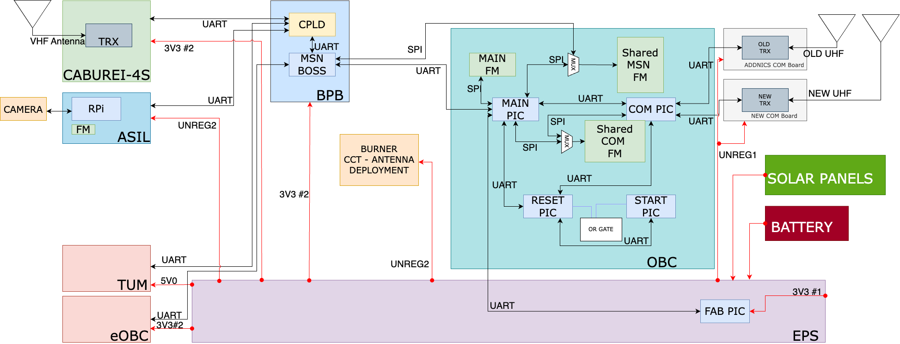

<p align=center>
 <h1>
  BIRDS-RP SATELLITE SOFTWARE DEVELOPER’S MANUAL 
 </h1>
</p>


<p align=center>

</p>


## Introduction 
 
### Document Purpose 
This document is prepared to share a thorough explaination of the execution of the BIRDS-RP satellite bus software. 

The system block diagram of the BIRDS-RP satellite is detailed in figure 1 below. 
 
BUS SYSTEM BLOCK DIAGRAM



OBC BLOCK DIAGRAM


DETAILED OBC BLOCK DIAGRAM

The organisational file stucture of the microcontrollers in the BIRDS-RP OBC board is detailed in  figure 2 below. 


## 1. START PIC


The files found in the START PIC folder are detailed in Table 1 below. 

|  File name pattern   | Scope  |  Content    |
|----------------------|--------|-------------|
| STRATPIC.c |    |    |
|  StartPIC_Functions.c  |    |    |


This is a system where data arrives asynchronously and must be processed in real-time without losing bytes. 

It uses a mix of hardware register mappings and UART (Universal Asynchronous Receiver-Transmitter) configuration to handle communication and operations. 

This code sets up a hardware abstraction layer for:
- Timer 1 Configuration: Provides named access to specific bits in the T1CON register for controlling and configuring the Timer 1 peripheral.
- Data Communication: Configures a UART interface and declares variables and buffers for handling incoming and outgoing data.
  
It uses interrupts to receive data, buffers it, and provides functions to read from the buffer and process incoming data. 

Let's break it down line by line:

 
### STARTPIC_FUNCTIONS.C 

#### Hardware Register and Bit Definitions

``` c
#byte T1CON = 0x018
```
This line declares a byte (8-bit value) variable T1CON mapped to the hardware memory address 0x018. This address typically corresponds to the T1CON register in a microcontroller, which is used to control Timer 1. The register allows configuration of timer settings, such as prescaling, synchronization, and enabling the timer.


``` c
#bit    TMR1ON = T1CON.0
```
Declares TMR1ON as a bit within the T1CON register at bit position 0. TMR1ON is used to enable or disable Timer 1.


``` c
#bit    T1SYNC = T1CON.2
```
Maps T1SYNC to bit position 2 of the T1CON register. This bit controls the synchronization of Timer 1 with an external clock source.


``` c
#bit    T1OSCEN = T1CON.3
```
Maps T1OSCEN to bit position 3. This bit enables or disables the Timer 1 oscillator.


``` c
#bit    T1CKPS0 = T1CON.4
```
Maps T1CKPS0 to bit position 4. This bit is part of the prescaler configuration for Timer 1.


``` c
#bit    T1CKPS1 = T1CON.5
```
Maps T1CKPS1 to bit position 5. This works in combination with T1CKPS0 to set the prescaler value.


``` c
#bit    TMR1CS0 = T1CON.6
```
Maps TMR1CS0 to bit position 6. This bit is part of the configuration for the Timer 1 clock source.


``` c
#bit    TMR1CS1 = T1CON.7
```
Maps TMR1CS1 to bit position 7. Along with TMR1CS0, this sets the clock source for Timer 1.


#### Variable and Macro Definitions

``` c
unsigned int8 RPIC_TO_SPIC_ARRAY[10];
```
Declares an 8-bit unsigned integer array of size 10. This is used to store data being exchanged between two communication interfaces,  RPIC (Reset PIC) and SPIC (Start PIC).


```c
#define ON   0x69
#define OFF  0x96
```
Defines two macros: ON and OFF, with hexadecimal values 0x69 and 0x96. These represent status codes for controlling hardware.


``` c
char POWER_LINE_STATUS;
```
Declares a char variable to store the status of a power line,  representing whether the power is on or off.


#### UART Configuration and Buffer Variables

``` c
#define RP_BFR_SIZE 10
```
Defines the size of the RP_Buffer as 10 bytes,  for storing UART data


``` c
#use rs232(UART1, baud=38400, parity=N, bits=8, stream=RPIC, ERRORS)
```
Configures a UART communication interface:
- UART1: Uses UART1 hardware module.
- baud=38400: Sets the baud rate to 38,400 bits per second.
- parity=N: No parity bit is used.
- bits=8: 8 data bits per frame.
- stream=RPIC: Associates the UART stream with the name RPIC.
- ERRORS: Enables automatic handling of UART errors.


``` c
unsigned int8 RP_Buffer[RP_BFR_SIZE];
```
Declares an 8-bit unsigned integer array RP_Buffer of size RP_BFR_SIZE (10). This buffer stores incoming UART data.


``` c
unsigned int16 RP_Byte_Counter = 0;
```
Declares a 16-bit unsigned integer RP_Byte_Counter initialized to 0. It counts the number of bytes received or transmitted.


``` c
unsigned int8 RP_Overflow = 0;
```
Declares an 8-bit unsigned integer RP_Overflow initialized to 0. It indicates whether the RP_Buffer has overflowed.


``` c
unsigned int16 RP_Read_Byte_counter = 0;
```
Declares a 16-bit unsigned integer RP_Read_Byte_counter initialized to 0. It tracks the number of bytes read from the RP_Buffer.


``` c
unsigned int8 RP_Temp_byte = 0;
```
Declares an 8-bit unsigned integer RP_Temp_byte initialized to 0. This is a temporary variable for storing a single byte during processing.


#### Interrupt Service Routine (ISR) for UART

ISR (```SERIAL_ISR1()```): Handles incoming UART data efficiently, storing it in a buffer.

``` c
#INT_RDA
Void SERIAL_ISR1() // MAIN PIC UART interrupt loop
{
   if( RP_Byte_Counter < RP_BFR_SIZE )
   {
      RP_Buffer[RP_Byte_Counter] = fgetc(RPIC);
      RP_Byte_Counter++;
   }
   else RP_Overflow = fgetc(RPIC);
}
```

```INT_RDA```: This is the interrupt identifier for UART receive data available. It triggers whenever the UART hardware receives a byte.

```SERIAL_ISR1()```: The interrupt handler (ISR) for the UART.

Operation:
- If the buffer (```RP_Buffer```) has space:
The received byte is read from the UART (```fgetc(RPIC)```) and stored in the buffer at the current position (```RP_Byte_Counter```).
The byte counter (```RP_Byte_Counter```) increments.
- If the buffer is full:
The received byte is discarded by reading it (```fgetc(RPIC)```), and the overflow flag (```RP_Overflow```) is set. This prevents the UART hardware from getting stuck.

#### Function to Check Available Bytes

``` c
RPic_Available()
```
Checks buffer status.

``` c
unsigned int8 RPic_Available()
{
   return RP_Byte_Counter;
}
```
This function checks if there is data available to read from the buffer and returns the number of bytes currently in the buffer (```RP_Byte_Counter```).

#### Function to Read a Byte

``` c
RPic_Read()
```
Safely reads from the buffer, maintaining counters and avoiding overflow.

``` c
unsigned int8 RPic_Read()
{
   if (RP_Byte_Counter > 0)
   {    
      RP_Temp_byte = RP_Buffer[RP_Read_Byte_counter];
      RP_Byte_Counter--;
      RP_Read_Byte_counter++;
      if(RP_Byte_Counter == 0) RP_Read_Byte_counter = 0;
      return RP_Temp_byte; 
   }
   if (RP_Byte_Counter == 0)
   { 
      RP_Read_Byte_counter = 0;
      RP_Temp_byte = 0x00;
      return RP_Temp_byte; 
   }
}
```
1. Checks if there are bytes available (```RP_Byte_Counter > 0```):
- Reads the byte from RP_Buffer at the position of RP_Read_Byte_counter.
- Decreases the byte counter(```RP_Byte_Counter```) and increments the read index (```RP_Read_Byte_counter```).
- If the buffer is now empty (```RP_Byte_Counter == 0```), resets the read index (```RP_Read_Byte_counter = 0```).
2. If no data is available:
- Resets the read index and returns 0x00 as a default.

#### Function to Process Incoming UART Data

``` c
CHECK_UART_INCOMING_FROM_RESET_PIC()
```
Processes incoming messages, searches for a synchronization byte (0xAA), and stores the message in an array. It also sends part of the data to a PC for debugging or monitoring.

``` c
void CHECK_UART_INCOMING_FROM_RESET_PIC()
{
   if( Rpic_Available() )
   {
      delay_ms(10);
      for(int i=0; i<8; i++)
      {
         if( RPIC_Read() == 0xAA )
         {
            RPIC_TO_SPIC_ARRAY[0] = 0xAA;
            break;
         }
      }
      for(int i=1; i<10; i++)
      {
         RPIC_TO_SPIC_ARRAY[i] = RPIC_Read();
      }
      for(int i=0; i<3; i++)
      {
         fprintf(PC, "%X ", RPIC_TO_SPIC_ARRAY[i]);
      }
      fprintf(PC, "\n\r");
   }
}
```
1.Checks if data is available:
- Calls ```Rpic_Available()``` to see if the buffer has any bytes.
2. Waits briefly:
  - Introduces a 10 ms delay (```delay_ms(10)```). This might allow more data to arrive if the system is processing a multi-byte message.
3. Searches for a synchronization byte (```0xAA```):
- Loops up to 8 times, reading bytes using ```RPIC_Read()```.
- If it finds ```0xAA```, it stores it in the first position of the ```RPIC_TO_SPIC_ARRAY``` array and exits the loop.
4. Reads remaining data:
- Fills the rest of the ```RPIC_TO_SPIC_ARRAY``` array with the next 9 bytes from the buffer.
5. Prints the first three bytes to the PC:
- Sends the first three bytes from ```RPIC_TO_SPIC_ARRAY``` to a PC via another UART (```fprintf(PC, "%X ", ...)```).
- Ends the output with a newline and carriage return.

#### Initial power management
The next code defines three utility functions for managing power lines and clearing a communication array. These functions manage the power lines by controlling GPIO pins. A "low" state turns off the power, while a "high" state turns it on. Delays ensure stable transitions. Clearing the ```RPIC_TO_SPIC_ARRAY``` is essential for ensuring the integrity of data in UART-based communication. The ```POWER_LINE_STATUS``` variable is used to track whether power lines are on (ON) or off (OFF), which can be helpful for debugging or program logic.

**TURN_OFF_ALL_POWER_LINES()**
This function disables power to all connected components by setting specific control pins to a "low" state (0V).

``` c
void TURN_OFF_ALL_POWER_LINES()
{
   output_Low(PIN_D6); // Switch enable for COM PIC
   output_Low(PIN_D7); // Switch enable for Main PIC   
   output_Low(PIN_C2); // OCP switch disable for Unreg #1
   output_Low(PIN_C5); // OCP switch disable for Unreg #2
   
   POWER_LINE_STATUS = OFF;
   fprintf(PC, "Turned OFF Power lines\n\r");
}
```

- ```output_Low(PIN_D6)```; Sets the voltage of PIN_D6 to low, disabling the power line for the COM PIC.
- ```output_Low(PIN_D7)```; Sets the voltage of PIN_D7 to low, disabling the power line for the Main PIC.
- ```output_Low(PIN_C2)```; Disables the Over-Current Protection (OCP) switch for an unregulated power line labeled "Unreg #1".
- ```output_Low(PIN_C5)```; Disables the OCP switch for "Unreg #2".
- ```POWER_LINE_STATUS = OFF```; Updates the ```POWER_LINE_STATUS``` variable to the predefined constant OFF (0x96).
- ```fprintf(PC, "Turned OFF Power lines\n\r")```; Sends a message over a serial connection (to a PC or debugging terminal) to confirm the action.


**TURN_ON_ALL_POWER_LINES()**
This function enables power to all connected components by setting specific control pins to a "high" state (e.g., 3.3V or 5V).

``` c
void TURN_ON_ALL_POWER_LINES()
{
   output_High(PIN_D6);                                                         
   Delay_ms(50);
   output_High(PIN_D7);                                                         
   Delay_ms(50);
   output_High(PIN_C2);                                                         
   Delay_ms(50);
   output_High(PIN_C5);                                                         
   Delay_ms(50);
   
   POWER_LINE_STATUS = ON;
   fprintf(PC, "Turned ON Power lines\n\r");
}
```

- ```output_High(PIN_D6)```; Sets the voltage of PIN_D6 to high, enabling the power line for the COM PIC.
- ```Delay_ms(50)```; Waits for 50 milliseconds to stabilize the power line.
- ```output_High(PIN_D7)```; Enables the power line for the Main PIC. Another 50 ms delay is added for stability.
- ```output_High(PIN_C2)```; and ```output_High(PIN_C5)```;
Enables the OCP switches for the unregulated power lines "Unreg #1" and "Unreg #2," with 50 ms delays in between.
- ```POWER_LINE_STATUS = ON```; Updates the POWER_LINE_STATUS variable to the predefined constant ON (likely 0x69).
- ```fprintf(PC, "Turned ON Power lines\n\r")```; Sends a confirmation message to a PC or debugging terminal.

**CLEAR_RPIC_TO_SPIC_ARRAY()**
This function resets the ```RPIC_TO_SPIC_ARRAY``` to all zeros. This is used to clear stale or invalid data from the communication array.

``` c
void CLEAR_RPIC_TO_SPIC_ARRAY()
{
   for( int i = 0; i<10; i++ ) RPIC_TO_SPIC_ARRAY[i] = 0;
}
```

- ```for( int i = 0; i<10; i++ )```: Iterates through the 10 elements of the ```RPIC_TO_SPIC_ARRAY```.
- ```RPIC_TO_SPIC_ARRAY[i] = 0```: Sets each element of the array to 0, effectively clearing it.


### STARTPIC.C

This is the main code for the Start PIC MCU that manages power lines and checks for responses from another microcontroller (Reset PIC).

#### Headers and Configuration

``` c
#include <16F1789.h>
```
Includes the device-specific header file for the PIC16F1789 microcontroller. This provides access to hardware-specific definitions like registers, pins, and peripherals.

``` c
#fuses NOWDT, MCLR, NOBROWNOUT
```
- NOWDT: Disables the Watchdog Timer (WDT).
- MCLR: Enables the Master Clear Reset pin for manual reset.
- NOBROWNOUT: Disables the Brown-Out Reset feature, which would reset the MCU if the supply voltage drops below a threshold.


``` c
#use delay(Crystal = 16MHz, clock = 16MHz)
```
Specifies that the system uses a 16 MHz crystal oscillator.

``` c
#use rs232(baud=38400, parity=N, xmit=PIN_D3, bits=8, stream=PC, force_sw)
```
Configures a UART communication stream on PIN_D3 for transmitting data at 38,400 baud. The force_sw option enforces software-based serial communication.


**Global Variables**

``` c
unsigned int16 RPIC_RESPOND_SEC_COUNTER = 0;
unsigned int16 MLC = 0;

unsigned int16 SEC_COUNT = 0;
unsigned int8 ONEHOUR_FLAG = 0x00;
```

- ```RPIC_RESPOND_SEC_COUNTER```: Tracks how long the Reset PIC takes to respond.
- ```MLC```: A secondary counter used in the main loop.
- ```SEC_COUNT```: A timer counter incrementing every 100 ms to track one-hour periods.
- ```ONEHOUR_FLAG```: A flag indicating whether one hour has elapsed. 0xAA means one hour has passed.

``` c
char BB, CC;
```
Temporary variables to read inputs from pins.


#### Main Function
The main function manages the system by checking for responses from the Reset PIC, turning power lines ON/OFF based on conditions and handling a 1-hour timer and ensuring the system doesn't stall.

*Key Tasks:*
- Use UART communication to interact with another microcontroller.
- Track time for system stability and response.
- Control power lines for external components.
- Manage external Watchdog Timer toggling.

**Initialization**

``` c
void main()
{
   Delay_ms(500);
   fprintf(PC, "Start PIC booting...........\n\r");
```
- Delays startup by 500 ms to allow system stabilization.
- Sends a message over the UART (serial) indicating that the Start PIC is booting.

``` c
enable_interrupts(INT_RDA);
enable_interrupts(GLOBAL);
```
- Enables the Receive Data Available (RDA) interrupt for UART communication.
- Enables global interrupts for the system.

``` c
   TURN_ON_ALL_POWER_LINES();
```
Powers on all connected components by calling the function ```TURN_ON_ALL_POWER_LINES```.

``` c
   CC = input(PIN_B6);
   BB = input(PIN_B7);
```
Reads the digital state of pins PIN_B6 and PIN_B7 into variables CC and BB.

Let us delve further into the main loop itself to see how it works.
**Main Loop**
``` c
   while(TRUE)
   {
      CHECK_UART_INCOMING_FROM_RESET_PIC();
```

- Infinite Loop: Continuously executes system tasks.
- ```CHECK_UART_INCOMING_FROM_RESET_PIC```: Checks for data from the Reset PIC and processes it.

``` c
      if( ONEHOUR_FLAG == 0xAA )
      {
         if( (RPIC_TO_SPIC_ARRAY[0] == 0xAA) && (RPIC_TO_SPIC_ARRAY[1] == 0xBB) && (RPIC_TO_SPIC_ARRAY[2] == 0xCC) )
         {
            RPIC_RESPOND_SEC_COUNTER = 0;
            MLC = 0;
            if( POWER_LINE_STATUS == ON ) TURN_OFF_ALL_POWER_LINES();
            CLEAR_RPIC_TO_SPIC_ARRAY();
         }
```

- Checks if one hour has passed (```ONEHOUR_FLAG == 0xAA```).
- If the Reset PIC has sent a valid response (RPIC_TO_SPIC_ARRAY[0..2] match expected values), it:
  - Resets the response counter.
  - Turns off power lines if they are ON.
  - Clears the response buffer.

``` c
         if( MLC >= 50 )
         {
            MLC = 0;
            RPIC_RESPOND_SEC_COUNTER++;
         }
```
If MLC reaches 50 iterations, increment the response counter.

``` c
         if( RPIC_RESPOND_SEC_COUNTER >= 36 )
         {
            fprintf(PC, "Reset pic did not respond for three minute\n\r");
            RPIC_RESPOND_SEC_COUNTER = 0;
            TURN_ON_ALL_POWER_LINES();
         }
```
If no valid response from the Reset PIC after 3 minutes (36 counts), log a message and turn the power lines back on.

***Hourly Timer***

``` c
      if( ONEHOUR_FLAG == 0x00 )
      {
         SEC_COUNT++;
         if(SEC_COUNT >= 36000)     // one hour 36000
         {
            ONEHOUR_FLAG = 0xAA;
         }
      }
```

- If one hour hasn't passed (```ONEHOUR_FLAG == 0x00```), increment ```SEC_COUNT``` every 100 ms.
- Once ```SEC_COUNT``` reaches 36,000 (1 hour), set ```ONEHOUR_FLAG``` to ```0xAA```.

**Watchdog Toggle**
``` c
      delay_ms(100);
      Output_Toggle(PIN_B2);
```
- Delays 100 ms in each iteration.
- Toggles the state of PIN_B2 to reset an external Watchdog Timer.

Here's the flow diagram illustrating the operation of the microcontroller system based on the code. Each step is represented to show the system's initialization, main loop, and decision-making processes. 

Here is a flow diagram focused on the main loop


Here's the flow diagram illustrating the operation of the microcontroller system based on the code. Each step is represented to show the system's initialization, main loop, and decision-making processes. 

``` sql
          START
           |
           V
          +-----------------------+
          | Initialize System     |
          | - Delay for boot time |
          | - Enable interrupts   |
          | - Turn on power lines |
          | - Set inputs for CC,  |
          |   BB                  |
          +-----------------------+
           |
           | < -----------------------------------------------------------------------------------------+
           V                                                                                            |
          +-----------------------+                                                                     |
          | Check UART Incoming   |                                                                     |
          | - Look for 0xAA       |                                                                     |
          | - Store in RPIC array |                                                                     |
          | - Print first 3 bytes |                                                                     |
          +-----------------------+                                                                     |
           |                                                                                            |
           +--------------------------+                                                                 |
+->+---->  | Is ONEHOUR_FLAG == 0xAA? |-----> NO -----> Increment SEC_COUNT                             |
|  |       +--------------------------+                        |                                        |
|  |                   |                                       V                            +----------------------------+
|  |                 YES                                Is SEC_COUNT >= 36000? ---- NO -->  | Toggle Watchdog Timer (PIN)|
|  |                 |                                        |                             +----------------------------+
|  |                 V                                        |
|  |      +-----------------------------+                     |
|  |      | Process Hourly Tasks        |                     V
|  |      | - Check RPIC array for      |<-------------------YES
|  |      |   0xAA, 0xBB, 0xCC          |
|  |      | - Reset counters if valid   |
|  |      | - Turn off power if ON      |
|  |      +-----------------------------+
|  |                 |
|  |           Response VALID
|  |                 |
|  |                 |
|  |            Reset counters
|  |      Turn OFF power lines if ON
|  |                 |
|  |                 |
|  |                 V
|  |       +-------------------------------+
|  |       | Is Main Loop Counter >= 50?   |
|  |       +-------------------------------+     
|  |                 |
|  |                YES
|  |                 |
|  |                 V
|  |      +-----------------------------------+
|  |      |           Reset MLC               |
|  |      | Increment RPIC Response Counter   |
|  |      +-----------------------------------+
|  |                 |
|  |                 |
|  |                 V
|  |      +-------------------------------+
|  NO ----| Is RPIC Response Counter>= 36? | 
|         +-------------------------------+
|                  | 
|                 YES
|                  |
|                  V
|         +-----------------------------+
|         | No RPIC response: Turn ON   |
|         | power lines, reset counter  |
|          +-----------------------------+
|                    |
|                    |
|               Increment MLC
|                    |
|                    |
+---------<----------+
```

## 2. RESET PIC 


The files found in the RESET PIC folder are detailed in Table 2 below. 

|     File name pattern       | Scope  |  Content    |
|-----------------------------|--------|-------------|
| ADC_Power_Lines_Control.c   |  satellite power management and monitoring; it controls various power lines, monitors voltages and currents, and performs periodic resets.       |             |
| PIC18F67J94_registers.h     |        |             |
| RPIC_CPIC.c                 |        |             |
| RPIC_MPIC.c                 |        |             |
| RPIC_STARTPIC.c             |        |             |
| RTC_fun.c                   |        |             |
| ResetMain.c                 |        |             |
| ResetPIC_Functions.c        |        |             |

###  ADC_Power_Lines_Control.c 

This code manages power lines, resets the system, and monitors current and voltage using analog-to-digital converter (ADC). Each function is modular and updates ```POWER_LINE_STATUS``` to track the state of the system. Functions like ```SYSTEM_RESET``` and ```SYSTEM_RESET_24H``` ensure operational stability through scheduled or manual resets.

Here is a detailed breakdown of the functionality:

#### Global Definitions and Variables

``` c
#define ON  1
#define OFF 0
```
Defines symbolic constants ```ON``` and ```OFF``` for readability, representing ```1``` (ON) and ```0``` (OFF) states.

``` c
#define BB_ON_OCP_ON   1
#define BB_ON_OCP_OFF  2
#define BB_OFF_OCP_OFF 3
```
Defines states for a buck-boost converter and overcurrent protection (OCP):
- ```BB_ON_OCP_ON```: Buck-boost ON, OCP ON.
- ```BB_ON_OCP_OFF```: Buck-boost ON, OCP OFF.
- ```BB_OFF_OCP_OFF```: Buck-boost OFF, OCP OFF.

``` c
unsigned int8 POWER_LINE_STATUS = 0;
unsigned int8 RESET_TIME = 0;
```
- ```POWER_LINE_STATUS```: 8-bit variable where each bit indicates the status of different power lines or components.
- ```RESET_TIME```: Tracks the time when a system reset occurred.

#### Functions for System Components

MP_CP_BuckBoost(): This function controls the Main PIC <-> Com PIC buck-boost converter.

``` c
void MP_CP_BuckBoost(int1 status)
{
    if (status == ON)
    {
      output_LOW(PIN_C4);
    }
    if (status == OFF)
    {
      output_HIGH(PIN_C4);
    }
    RST_EXT_WDT();
}
```
- Turns the converter ON/OFF by controlling ```PIN_C4```.
- Calls ```RST_EXT_WDT()``` to reset an external watchdog timer (prevents system reset due to inactivity).

MainPic_Power(): This function manages power for the main microcontroller (Main PIC)

``` c
void MainPic_Power(int1 status)
{
    if (status == 1)
    {
       output_high(PIN_F5);
       BIT_SET(POWER_LINE_STATUS,7);
    }
    if (status == 0)
    {
       output_low(PIN_F5);
       BIT_CLEAR(POWER_LINE_STATUS,7);
    }
    delay_ms(50);
    RST_EXT_WDT();
}
```
- Activates/deactivates power to Main PIC via ```PIN_F5```.
- Updates bit 7 of ```POWER_LINE_STATUS``` to reflect the Main PIC's state.
- Adds a delay (debouncing) and resets the watchdog timer.

ComPic_Power(): This function manages power for the communication microcontroller (Com PIC)

``` c
void ComPic_Power(int1 status)
{
    if (status == 1)
    {
       output_high(PIN_F6);
       BIT_SET(POWER_LINE_STATUS,6);
    }
    if (status == 0)
    {
       output_low(PIN_F6);
       BIT_CLEAR(POWER_LINE_STATUS,6);
    }
    delay_ms(50);
    RST_EXT_WDT();
}
```
- Similar to ```MainPic_Power```, but controls ```PIN_F6``` and updates bit 6 of ```POWER_LINE_STATUS```.
- Adds a delay (debouncing) and resets the watchdog timer.

_3V3Power_Line1(): This function controls a 3.3V#1 power line with overcurrent protection

``` c
void _3V3Power_Line1(int1 status )
{
    if (status == BB_ON_OCP_ON)
    {
       output_high(PIN_D1);
       Delay_ms(50);
       output_high(PIN_D4);
       BIT_SET(POWER_LINE_STATUS,5);
    }

    if (status == BB_ON_OCP_OFF)
    {
       output_high(PIN_D1);
       output_low(PIN_D4);
       BIT_CLEAR(POWER_LINE_STATUS,5);
    }

    if (status == BB_OFF_OCP_OFF)
    {
       output_low(PIN_D1);
       output_low(PIN_D4);
       BIT_CLEAR(POWER_LINE_STATUS,5);
    }
    delay_ms(50);
    RST_EXT_WDT();
}
```
- Uses ```PIN_D1``` to control the buck-boost converter and ```PIN_D4``` to control OCP.
- Updates bit 5 of ```POWER_LINE_STATUS``` to reflect the 3.3V#1 power line state.
- Adds a delay (debouncing) and resets the watchdog timer.

#### Other Line-Control Functions

- ```_3V3Power_Line2```
  - Uses ```PIN_D2``` to control the buck-boost converter and ```PIN_D5``` to control OCP.
  - Updates bit 4 of ```POWER_LINE_STATUS``` to reflect the 3.3V#2 power line state.
  - Adds a delay (debouncing) and resets the watchdog timer.
 
- ```_5V0Power_Line```, 
  - Uses ```PIN_D3``` to control the buck-boost converter and ```PIN_D6``` to control OCP.
  - Updates bit 3 of ```POWER_LINE_STATUS``` to reflect the 5.0V power line state.
  - Adds a delay (debouncing) and resets the watchdog timer.
  
- ```Unreg1_Line```, 
  - Uses ```PIN_D7``` to control OCP.
  - Updates bit 2 of ```POWER_LINE_STATUS``` to reflect the Unreg1 power line state.
  - Adds a delay (debouncing) and resets the watchdog timer.
 
- ```Unreg2_Line```:
  - Uses ```PIN_D0``` to control OCP.
  - Updates bit 1 of ```POWER_LINE_STATUS``` to reflect the Unreg2 power line state.
  - Adds a delay (debouncing) and resets the watchdog timer.

#### System Reset Functions

SYSTEM_RESET(): Performs a manual system reset of the satellite by command from PC or GS

``` c
void SYSTEM_RESET()
{  
   int sec_c = 0;
   Fprintf(PC,"system reset by command \n\r");
   // turn off system
   MainPic_Power(OFF)                ;  Delay_ms(250) ; 
   ComPic_Power(OFF);Delay_ms(250)   ;  Delay_ms(250) ; 
   _3V3Power_Line1(BB_OFF_OCP_OFF)   ;  Delay_ms(250) ; 
   _3V3Power_Line2(BB_OFF_OCP_OFF)   ;  Delay_ms(250) ; 
   _5V0Power_Line(BB_OFF_OCP_OFF)    ;  Delay_ms(250) ; 
   Unreg1_Line(OFF);Delay_ms(250)    ;  Delay_ms(250) ; 
   Unreg2_Line(OFF);Delay_ms(250)    ;  Delay_ms(250) ;

   RESET_TIME = hour;

   for (int i = 0; i < 10; i++)
   {
       Delay_ms(500);
       RST_EXT_WDT();
       Delay_ms(500);
       RST_EXT_WDT();
       sec_c++;
       Fprintf(PC, "Waiting to turn on system again %02d Sec\n\r", sec_c);
   }

   // turn on system
   MainPic_Power(ON)                ;    Delay_ms(250) ;      
   ComPic_Power(ON)                 ;    Delay_ms(250) ;      
   _3V3Power_Line1(BB_ON_OCP_ON)    ;    Delay_ms(250) ;     
   _3V3Power_Line2(BB_ON_OCP_ON)    ;    Delay_ms(250) ;       
   _5V0Power_Line(BB_ON_OCP_ON)     ;    Delay_ms(250) ;      
   Unreg1_Line(ON)                  ;    Delay_ms(250) ;     
   Unreg2_Line(OFF)                 ;    Delay_ms(250) ;
}
```
- Sequentially turns off all components.
- Set reset time to 1 hour
- Waits 10 seconds, resetting the watchdog timer periodically (every  half second).
- Turns all components back on after the delay.

SYSTEM_RESET_24H(): This function automates a daily reset at a specific time. Similar to SYSTEM_RESET(), but triggered when hour, minute, and second match predefined values.

#### ADC Measurement Functions

Each power rail or unregulated line has a sensor (e.g., a current sensor or voltage divider) connected to the analog input of the microcontroller. The microcontroller reads these analog signals and converts them into digital values using its ADC module.

The ADC readings are stored in the corresponding variables (```_Raw_power_ADC_val```, ```_3V3_1_current_ADC_val```, etc.) for further processing or monitoring.

These values are used for:
- Power system diagnostics (e.g., detecting overcurrent conditions).
- Monitoring power health in real-time.
- Logging and telemetry 

**Commented Section**

The commented code below describes how certain hardware signals are being monitored and measured using analog-to-digital conversion.

``` c
// C3 = Raw power monitor enable
// A2 (AN2) = Raw voltage measure
// A1 (AN1) = 3V3-1 current measure
// A0 (AN0) = 3V3-2 current measure
// A5 (AN4) = 5V0 current measure
// A4 (AN6) = UNREG-1 current measure
// C2 (AN9) = UNREG-2 current measure
```

Each signal is mapped to a specific pin (or port) on the microcontroller, and the purpose of that pin is described:

1. ```C3 = Raw power monitor enable```
- This pin (```C3```) controls a pin used to enable or disable monitoring of the raw power input. It is toggled as needed to save power and/or isolate specific circuits.
2. ```A2 (AN2) = Raw voltage measure```
- Analog channel 2 (```AN2```) is used to measure the raw voltage level. This represents the voltage coming directly from the power source before regulation.
3. ```A1 (AN1) = 3V3-1 current measure```
- Analog channel 1 (```AN1```) measures the current flowing through the 3.3V#1 power rail (```3V3-1```).
4. ```A0 (AN0) = 3V3-2 current measure```
- Analog channel 0 (```AN0```) measures the current flowing through the 3.3V#2 power rail (```3V3-2```).
5. ```A5 (AN4) = 5V0 current measure```
- Analog channel 4 (```AN4```) measures the current on the 5V power line.
6. ```A4 (AN6) = UNREG-1 current measure```
- Analog channel 6 (```AN6```) measures the current for an unregulated power line labeled UNREG-1.
7. ```C2 (AN9) = UNREG-2 current measure```
- Analog channel 9 (```AN9```) measures the current for another unregulated power line labeled UNREG-2.

``` c
unsigned int16 _Raw_power_ADC_val       = 0 ;          
unsigned int16 _3V3_1_current_ADC_val   = 0 ;          
unsigned int16 _3V3_2_current_ADC_val   = 0 ;          
unsigned int16 _5V0_current_ADC_val     = 0 ;          
unsigned int16 _UNREG_1_current_ADC_val = 0 ;      
unsigned int16 _UNREG_2_current_ADC_val = 0 ;
```

**Variables**

The variables declared are used to store the ADC (Analog-to-Digital Conversion) readings for the respective signals.

- ```unsigned int16 _Raw_power_ADC_val = 0```; Holds the ADC result for the raw power voltage measurement (from AN2).
- ```unsigned int16 _3V3_1_current_ADC_val = 0```; Stores the ADC result for the current measurement of 3V3-1 (from AN1).
- ```unsigned int16 _3V3_2_current_ADC_val = 0```; Stores the ADC result for the current measurement of 3V3-2 (from AN0).
- ```unsigned int16 _5V0_current_ADC_val = 0```; Holds the ADC result for the current measurement of the 5V power line (from AN4).
- ```unsigned int16 _UNREG_1_current_ADC_val = 0```; Stores the ADC result for the current measurement of the unregulated power line UNREG-1 (from AN6).
- ```unsigned int16 _UNREG_2_current_ADC_val = 0```; Stores the ADC result for the current measurement of the unregulated power line UNREG-2 (from AN9).

**Current measuring functions**

Measure_*(): These functions measure voltages and currents for different lines with '*' being replaced with;
- Raw_voltage
- 3V3_1_current
- 3V3_2_current
- 5V0_current
- UNREG_1_current
- UNREG_2_current

``` c
unsigned int16 Measure_Raw_voltage() // A2 (AN2) = Raw voltage measure
{
    Output_low(PIN_C3);
    Delay_us(100);

    SET_ADC_CHANNEL(2);
    delay_us(20);
    Output_high(PIN_C3);
    return READ_ADC();
}
```
- The function returns a ```16-bit unsigned integer```. This integer represents the digital value of the voltage measured at analog channel 2 (```AN2```), corresponding to the raw voltage.
- Sets **PIN_C3** to a low logic level (0). In the comments, ```C3``` is described as the "Raw power monitor enable" pin. Setting it low activates the raw voltage measurement circuit (e.g., by powering on a sensor or enabling a voltage divider).
- Introduces a delay of 100 microseconds. This allows the circuitry connected to PIN_C3 to stabilize after being activated. Stabilization is important for accurate ADC readings, especially in systems with capacitors or sensors.
- Configures the ADC to read from channel 2 (```AN2```), which is connected to the raw voltage signal.
- Introduces a smaller delay (20 microseconds) to allow the ADC hardware to stabilize after switching channels. This ensures the input signal is correctly sampled.
- Sets PIN_C3 to a high logic level (1). This disables the raw voltage measurement circuit, conserving power or isolating the circuit when not in use.
- Performs an ADC conversion and returns the digital value representing the measured raw voltage. The ```READ_ADC()``` function converts the analog signal at channel 2 into a numerical value, which corresponds to the voltage level based on the system's ADC resolution and reference voltage.

The remaining functions do not toggle pin outputs, they only set the ADC channel, delay, then return the value of the READ_ADC() function.

- ```unsigned int16 Measure_3V3_1_current()```
   - Configures the ADC to read from channel 1 (```AN1```), which is connected to the 3v3-1 current measure signal.
   - Introduces a small delay (20 microseconds) to allow the ADC hardware to stabilize after switching channels.
   - Performs an ADC conversion and returns the digital value representing the measured 3v3-1 voltage.
- ```unsigned int16 Measure_3V3_2_current()```
   - Configures the ADC to read from channel 0 (```AN0```), which is connected to the 3v3-2 current measure signal.
   - Introduces a small delay (20 microseconds) to allow the ADC hardware to stabilize after switching channels.
   - Performs an ADC conversion and returns the digital value representing the measured 3v3-2 voltage.
- ```unsigned int16 Measure_5V0_current()```
   - Configures the ADC to read from channel 4 (```AN4```), which is connected to the 5v0 current measure signal.
   - Introduces a small delay (20 microseconds) to allow the ADC hardware to stabilize after switching channels.
   - Performs an ADC conversion and returns the digital value representing the measured 5v0 voltage.
- ```unsigned int16 Measure_UNREG_1_current()```
   - Configures the ADC to read from channel 6 (```AN6```), which is connected to the UNREG-1 current measure signal.
   - Introduces a small delay (20 microseconds) to allow the ADC hardware to stabilize after switching channels.
   - Performs an ADC conversion and returns the digital value representing the measured unreg-1 voltage.
- ```unsigned int16 Measure_UNREG_2_current()```
   - Configures the ADC to read from channel 9 (```AN9```), which is connected to the UNREG-2 current measure signal.
   - Introduces a small delay (20 microseconds) to allow the ADC hardware to stabilize after switching channels.
   - Performs an ADC conversion and returns the digital value representing the measured unreg-2 voltage.

### PIC18F67J94_registers.h 

This block of code is a series of register and bit definitions for working with the Reset PIC microcontroller. It sets up low-level hardware access by mapping the microcontroller's memory-mapped registers and specific bits to easy-to-use variable names. It allows developers to:
1. Configure pin directions (TRIS registers).
2. Control output states (LAT registers).
3. Read or write pin states (PORT registers).
4. Manage peripherals like RTCs, timers, and interrupts.

Here's a line-by-line explanation:

#### Byte Definitions for TRIS Registers

A TRIS register, or tri-state register, is a control register in Microchip PIC microcontrollers that configures the direction of data flow through a port's I/O pins.

``` c
#byte TRISG = 0xF98
#byte TRISF = 0xF97
#byte TRISE = 0xF96
#byte TRISD = 0xF95
#byte TRISC = 0xF94
#byte TRISB = 0xF93
#byte TRISA = 0xF92
```
- TRIS Registers are used to configure the direction of pins (input or output) for each port (```A``` to ```G```).
- Setting a TRIS bit to ```1``` makes the corresponding pin an **input**; setting it to ```0``` makes it an **output**.
- These definitions map the TRIS registers to their respective memory addresses (hex values starting at ```0xF92```).

#### Byte Definitions for LAT Registers

``` c
#byte LATG = 0xF8F
#byte LATF = 0xF8E
#byte LATE = 0xF8D
#byte LATD = 0xF8C
#byte LATC = 0xF8B
#byte LATB = 0xF8A
#byte LATA = 0xF89
```
- LAT Registers (LATCH) control the output state of pins.
- Writing to a LAT register sets the state of the corresponding port pins (```1``` = HIGH, ```0``` = LOW).
- These definitions link LAT registers to their specific memory locations.

#### Bit-Level Access to TRIS Registers

``` c
#bit TRISE0 = TRISE.0
#bit TRISE1 = TRISE.1
#bit TRISE2 = TRISE.2
#bit TRISC4 = TRISC.4
#bit TRISB3 = TRISB.3
#bit TRISA0 = TRISA.0
#bit TRISA1 = TRISA.1
#bit TRISA2 = TRISA.2
#bit TRISA5 = TRISA.5
```
- Individual bits within the TRIS registers are defined for ease of access.
- Example: ```TRISE0``` refers to bit 0 of the ```TRISE``` register (controls direction for pin ```E0```).

#### Bit-Level Access to LAT Registers

``` c
#bit LATA0 = LATA.0
#bit LATA1 = LATA.1
#bit LATA2 = LATA.2
#bit LATA3 = LATA.3
```
- Defines specific bits in the LAT registers, corresponding to individual pins on port A.
- Example: ```LATA0``` controls the state of pin ```A0```.

#### Byte Definitions for PORT Registers

``` c
#byte PORTG = 0xF86
#byte PORTF = 0xF85
#byte PORTE = 0xF84
#byte PORTD = 0xF83
#byte PORTC = 0xF82
#byte PORTB = 0xF81
#byte PORTA = 0xF80
```
**PORT Registers** hold the current state of pins on each port. Reading a PORT register retrieves the pin states, and writing to a PORT register directly changes output levels (if configured as outputs).

#### Bit-Level Access to PORT Registers

``` c
#bit RG0 = PORTG.0
#bit RG1 = PORTG.1
#bit RG2 = PORTG.2
#bit RG3 = PORTG.3
#bit RF2 = PORTF.2
#bit RE2 = PORTE.2
#bit RC0 = PORTC.0
#bit RB3 = PORTB.3
#bit RA0 = PORTA.0
```
- Bit-level definitions for individual pins on ports.
- Example: ```RG0``` refers to bit 0 of PORTG, representing the state of pin ```G0```.

#### Real-Time Clock Control and Alarm

The RTC (Real-Time Clock) section defines control registers and bits for managing the clock and alarms.

``` c
#byte RTCCON1 = 0xF5F
#bit RTCPTR0 = RTCCON1.0
#bit RTCPTR1 = RTCCON1.1
#bit RTCOE = RTCCON1.2
#bit HALFSEC = RTCCON1.3
#bit RTCSYNC = RTCCON1.4
#bit RTCWREN = RTCCON1.5
#bit RTCEN = RTCCON1.7
```
- ```RTCCON1``` is the control register for the RTC.
   - ```RTCPTR0``` and ```RTCPTR1``` are specific bits within this register, for configuring the pointer to RTC data.
   - ```RTCOE ```
   - ```HALFSEC```
   - ```RTCSYNC```
   - ```RTCWREN```
   - ```RTCEN```

``` c
#byte RTCCAL = 0xF5E
#byte RTCVALH = 0xF5D
#bit    WAITE0 = RTCVALH.0
#bit    WAITE1 = RTCVALH.1
#bit    WAITM0 = RTCVALH.2
#bit    WAITM1 = RTCVALH.3
#bit    WAITM2 = RTCVALH.4
#bit    WAITM3 = RTCVALH.5
#bit    WAITB0 = RTCVALH.6
#bit    WAITB1 = RTCVALH.7
```
- ```RTCCAL``` is the ... register for the RTC.
- ```RTCVALH``` is the ... register for the RTC.
   - ```WAITE0``` is a specific bit within the RTCVALH register, for configuring the ...
   - ```WAITE1```
   - ```WAITM0```
   - ```WAITM1```
   - ```WAITM2```
   - ```WAITM3```
   - ```WAITB0```
   - ```WAITB1```
 
``` c
#byte RTCVALL = 0xF5C
#byte ALRMCFG = 0xF5B
#bit    ALRMPTR0 = ALRMCFG.0
#bit    ALRMPTR1 = ALRMCFG.1
#bit    AMASK0 = ALRMCFG.2
#bit    AMASK1 = ALRMCFG.3
#bit    AMASK2 = ALRMCFG.4
#bit    AMASK3 = ALRMCFG.5
#bit    CHIME = ALRMCFG.6
#bit    ALRMEN = ALRMCFG.7
```
- ```RTCVALL``` is the ... register for the RTC.
- ```ALRMCFG``` is the ... register for the Alarm.
   - ```ALRMPTR0``` is a specific bit within the RTCVALH register, for configuring the ...
   - ```ALRMPTR1```
   - ```AMASK0```
   - ```AMASK1```
   - ```AMASK2```
   - ```AMASK3```
   - ```CHIME```
   - ```ALRMEN```
 
``` c
#byte ALRMRPT = 0xF5A
#byte ALRMVALH = 0xF59
#byte ALRMVALL = 0xF58
#byte RTCCON2 = 0xF57
#bit    RTCSECSEL0 = RTCCON2.0
#bit    RTCSECSEL1 = RTCCON2.1
#bit    RTCCLKSEL0 = RTCCON2.2
#bit    RTCCLKSEL1 = RTCCON2.3
#bit    PWCSPRE = RTCCON2.4
#bit    PWCCPRE = RTCCON2.5
#bit    PWCPOL = RTCCON2.6
#bit    PWCEN = RTCCON2.7
```
- ```ALRMRPT``` is the ... register for the RTC.
- ```ALRMVALH``` is the ... register for the RTC.
- ```ALRMVALL``` is the ... register for the RTC.
- ```RTCCON2``` is the ... register for the Alarm.
   - ```RTCSECSEL0``` is a specific bit within the RTCCON2 register, for configuring the ...
   - ```RTCSECSEL1```
   - ```RTCCLKSEL0```
   - ```RTCCLKSEL1```
   - ```PWCSPRE```
   - ```PWCCPRE```
   - ```PWCPOL```
   - ```PWCEN```

#### Other Control Registers

``` c
#byte EECON2 = 0xF7E
#byte OSCCON = 0xFD3
#byte T1CON = 0xFCD
#bit  T1CON7 = T1CON.7
#bit  T1CON6 = T1CON.6
#bit  SOSCEN1 = T1CON.3
#bit  TMR1ON = T1CON.0
#byte T3CON = 0xFB1
#bit  SOSCEN3 = T3CON.3
```
- These are control registers for various peripherals:
   - ```EECON2```: 
   - ```OSCCON```: Oscillator control.
   - ```T1CON```: Timer 1 control.
     - ```T1CON7``` refers to bit 7 of T1CON, enabling ...
     - ```T1CON6``` refers to bit 6 of T1CON, enabling ...
     - ```SOSCEN1``` refers to bit 3 of T1CON, enabling ...
     - ```TMR1ON``` refers to bit 0 of T1CON, enabling ... 
   - ```T3CON```: Timer 3 control.
     - ```SOSCEN3``` refers to bit 3 of T3CON, enabling ... 

#### Interrupt and Miscellaneous Registers

``` c
#byte PIE3 = 0xFA3
#bit RC2IE = PIE3.5
```
- ```PIE3``` is an interrupt enable register for specific peripherals.
  - ```RC2IE``` refers to bit 5 of PIE3, enabling an interrupt for the RC2 peripheral.


### RPIC_CPIC.c


#### 

 here we check main pic UART is available or not if available we save in MPIC_TO_RPIC array

``` c
void CHECK_UART_INCOMING_FROM_COM_PIC()
{
   if( CPic_Available() )
   {
      Delay_ms(100);
      for( int i = 0; i<10; i++ )
      {
         if( CPic_Read() == 0xC0 )
         {
            CPIC_TO_RPIC_ARRAY[0] = 0xC0 ;
            break;
         }
      }

      for(int i = 1; i<=30; i++)
      {
         CPIC_TO_RPIC_ARRAY[i] = CPic_Read();
      }
   }
}
```


this function will print recived command from com pic
``` c
void PRINT_RECIVED_COMMAND_FROM_COM_PIC()
{
   printline();
   Fprintf(PC,"RCVD CMD FROM COM PIC >> ");
   for(int i = 0; i<20; i++)
   {
      Fprintf(PC,"%X ",CPIC_TO_RPIC_ARRAY[i]);
   }
   printline();
}
```


this fucntons monitor the com pic. if no response within 10min reset pic
will restart the com pic
``` c
void MONITOR_COM_PIC_90SEC_COMUNICATION(int time)
{
   if( CPIC_TIME_COUNTER >= 600 )
   {
      CPIC_TIME_COUNTER = 0;
      NUMOF_CPIC_RST++;
      
      ComPic_Power(0);   // turn off main pic
      for( int i = 0; i<time ; i++)
      {
         Delay_ms(1000);
        Fprintf(PC,"Waiting to turn on com Pic %02d Sec\n\r",i);
      }
      ComPic_Power(1);   // turn on main pic
   }
}
```

``` c
void RESEPOND_TO_CPIC_90SEC_CMD()
{
   if(CPIC_TO_RPIC_ARRAY[1] == 0xE0)
   {
      Fprintf(PC,"90 seconds comunication command\n\r");
      
      CPIC_TIME_COUNTER = 0;             // because comunication happaned corretly
      CLEAR_DATA_ARRAY( RPIC_TO_CPIC_ARRAY, 20);
      RPIC_TO_CPIC_ARRAY[0]  = 0xC0   ;
      RPIC_TO_CPIC_ARRAY[1]  = 0xE0   ; 
      
      RPIC_TO_CPIC_ARRAY[2]  = year   ;
      RPIC_TO_CPIC_ARRAY[3]  = month  ;
      RPIC_TO_CPIC_ARRAY[4]  = day    ;
      RPIC_TO_CPIC_ARRAY[5]  = hour   ;
      RPIC_TO_CPIC_ARRAY[6]  = minute ;
      RPIC_TO_CPIC_ARRAY[7]  = second ;
      
      RPIC_TO_CPIC_ARRAY[19] = 0xC1   ;
      for(int i = 0; i<20; i++)
      {
         fputc(RPIC_TO_CPIC_ARRAY[i],CPic);
      }
      printline();
      //_______________________________________________________________________
      
   } 
}
```


``` c


Void UPDATE_RTC_BY_COM_PIC_CMD()
{
   if(CPIC_TO_RPIC_ARRAY[1] == 0xEA) //MP HF
   {
      Fprintf(PC,"Reset pic RTC update command Received from COM PIC\n\r");
      
      // Acknowleging to the comand____________________________________________
      Delay_ms(10);
      CLEAR_DATA_ARRAY( RPIC_TO_CPIC_ARRAY, 20);
      RPIC_TO_CPIC_ARRAY[0]  = 0xC0   ;
      RPIC_TO_CPIC_ARRAY[1]  = 0xEA   ;
      RPIC_TO_CPIC_ARRAY[19] = 0xC1   ;
      for(int i = 0; i<20; i++)
      {
         fputc(RPIC_TO_CPIC_ARRAY[i],CPic);
      }
      //_______________________________________________________________________
      
      //Updating the RTC
      year   = CPIC_TO_RPIC_ARRAY[2]  ;
      month  = CPIC_TO_RPIC_ARRAY[3]  ;
      day    = CPIC_TO_RPIC_ARRAY[4]  ;
      hour   = CPIC_TO_RPIC_ARRAY[5]  ;
      minute = CPIC_TO_RPIC_ARRAY[6]  ;
      second = CPIC_TO_RPIC_ARRAY[7]  ;
     

      //Printing New RTC value
      Fprintf(PC,"Updated New Time >> ") ;
      Fprintf(PC,"%u-", year)        ;
      Fprintf(PC,"%u-", month)       ;
      Fprintf(PC,"%u__", day)        ;
      Fprintf(PC,"%u:", hour)        ;
      Fprintf(PC,"%u:", minute)      ;
      Fprintf(PC,"%u\n\r", second)   ;
       
   }
}
```


``` c
void SENDING_TIME_TO_COMPIC()
{
   if(CPIC_TO_RPIC_ARRAY[1] == 0xEB)
   {
      Fprintf(PC,"SENDING_TIME_TO_COMPIC\n\r");
      
      CPIC_TIME_COUNTER = 0;             // because comunication happaned corretly
      CLEAR_DATA_ARRAY( RPIC_TO_CPIC_ARRAY, 20);
      RPIC_TO_CPIC_ARRAY[0]  = 0xC0   ;
      RPIC_TO_CPIC_ARRAY[1]  = 0xEB   ; 
      
      RPIC_TO_CPIC_ARRAY[2]  = year   ;
      RPIC_TO_CPIC_ARRAY[3]  = month  ;
      RPIC_TO_CPIC_ARRAY[4]  = day    ;
      RPIC_TO_CPIC_ARRAY[5]  = hour   ;
      RPIC_TO_CPIC_ARRAY[6]  = minute ;
      RPIC_TO_CPIC_ARRAY[7]  = second ;
      
      RPIC_TO_CPIC_ARRAY[19] = 0xC1   ;
      for(int i = 0; i<20; i++)
      {
         fputc(RPIC_TO_CPIC_ARRAY[i],CPic);
      }
      printline();
      //_______________________________________________________________________
      
   } 
}
```


## 3. MAIN PIC


### Code Breakdown
#### 1. Header Files and Configuration
``` c
#include <18F67J94.h>
#FUSES NOWDT,NOBROWNOUT,SOSC_DIG
#use delay(crystal = 16MHz, clock = 16MHz)
#include <PIC18F67J94_REGISTERS.h>
#include <stdio.h>
#include <18F67J94.h>: Includes the device-specific header file.
``` 
FUSES: Configuration fuses set up the microcontroller's behavior:
NOWDT: Disables the Watchdog Timer.
NOBROWNOUT: Disables Brown-out Reset.
SOSC_DIG: Configures the secondary oscillator for digital mode.
``` c
#use delay: Sets the crystal frequency and system clock.
#include <PIC18F67J94_REGISTERS.h>: Defines registers for specific hardware components.
``` 
#### 2. External Files
``` c
#include <MainPIC_Settings.c>
#include <RTC_functions.c>
#include <Flash_Memory.c>
#include <RESERVE_fun.c>
#include <MPIC_RPIC.c>
#include <MPIC_FAB.c>
#include <MPIC_MBOSS.c>
#include <MPIC_CPIC.c>
#include <Debug.c>
```
These files implement modular functionalities, such as:

RTC_functions.c: RTC setup and manipulation.
Flash_Memory.c: Flash memory operations.
Debug.c: Debugging utilities.
#### 3. Interrupt Priority Configuration
``` c
#PRIORITY INT_RDA4, INT_RDA2, INT_RDA3, INT_RDA
```
Configures interrupt priorities for UART communication on different ports.
#### 4. setting() Function
``` c
Void setting()
{
   enable_interrupts(INT_RDA);
   enable_interrupts(INT_RDA2);
   enable_interrupts(INT_RDA3);
   enable_interrupts(INT_RDA4);
   enable_interrupts(GLOBAL);
   
   Output_Low(PIN_A4);
   SETUP_RTC(RTC_ENABLE | RTC_CLOCK_SOSC, 0);
   Write_OBC_RTC(23, 07, 28, 00, 00, 01);
   
   OUTPUT_HIGH(PIN_C5);
   OUTPUT_HIGH(PIN_A5);
   
   output_HIGH(MBOSS_EN);
}
```
Enables UART interrupts for communication with other PICs.
Configures the RTC and initializes its values.
Sets up pins to enable or disable certain components like the On-Board Computer (OBC) and Mission Boss (MBOSS).
#### 5. main() Function
The main() function orchestrates all operations.

Initialization
``` c
Delay_ms(1000);
setting();
fprintf(PC, "MainPIC booting...........\n\r");
```
Delays for 1 second, initializes the system, and sends a debug message to the PC.
System Initialization and Operations
``` c
LOAD_ANTENNA_DEPLOYMENT_VALUES();
LOAD_RESERVATION_COMMANDS_ON_OFF_TIME_AT_BOOT();
LOAD_30DAY_COUNTER();
INCREACE_30DAY_COUNTER_ONCE_PER_DAY_AND_CHECK_30DAY_CW_STATUS();
```
Loads settings for antenna deployment, reservation commands, and counters for monitoring system status.
Infinite Loop
``` c
while(true)
{
   READ_MP_RTC_AND_PRINT();
   DEPLOY_ANTENNAS_SET_1(31, 5);
   DEPLOY_ANTENNAS_SET_2(40, 5);
   COMUNICATION_WITH_RST_PIC_90SEC(90);
   CHECK_RESERVATION_COMMAND_ON_TIME_AND_OFF_TIME();
   RESTARTING_MISSIONS_AFTER_SYSTEM_RESET();
   CHECK_UART_INCOMING_FROM_DEBUG_PORT();
   CHECK_UART_INCOMING_FROM_COM_PIC();
}
```
RTC Operations: Reads and prints the RTC values.
Antenna Deployment: Configures antenna deployment based on time and other parameters.
Communication: Interacts with the Reset PIC every 90 seconds and checks incoming UART commands.
Command Handling
Commands from COM PIC

``` c
if(CPIC_TO_MPIC_ARRAY[0] == 0xB0 && CPIC_TO_MPIC_ARRAY[39] == 0xB1)
{
   PRINT_RECIVED_COMMAND_FROM_COM_PIC();
   Delay_ms(5);
   GIVE_COMFM_ACCESS_TO_COMPIC_FOR_DATA_DOWNLOAD();
   // Other operations...
   CLEAR_DATA_ARRAY(CPIC_TO_MPIC_ARRAY, 32);
}
```
Commands from Debug Port
``` c
if(DEBUG_TO_MPIC_ARRAY[0] == 0xD0 && DEBUG_TO_MPIC_ARRAY[12] == 0xD1)
{
   PRINT_RECIVED_COMMAND_FROM_DEBUG_PORT();
   Delay_ms(5);
   READ_FM_DATA_THROUGH_PC();
   // Other operations...
   CLEAR_DATA_ARRAY(DEBUG_TO_MPIC_ARRAY, 20);
}
```
Handles specific command sequences received through UART, performs necessary tasks, and clears the command buffer.
