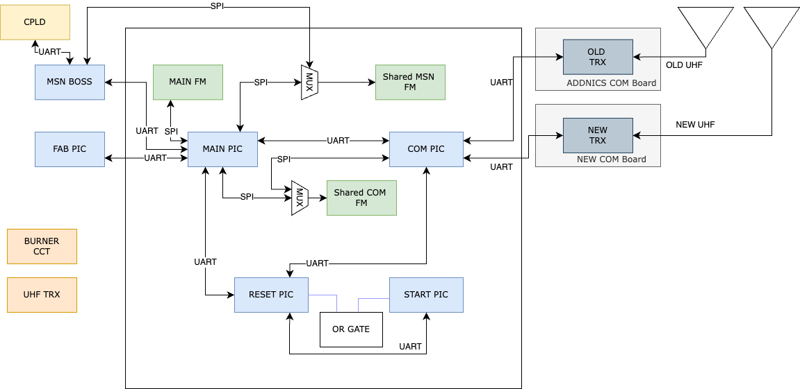

<p align=center>
 <h1>
  BIRDS-RP SATELLITE SOFTWARE DEVELOPER’S MANUAL 
 </h1>
</p>


<p align=center>

</p>


## Introduction 
 
### Document Purpose 
This document is prepared to share a thorough explaination of the execution of the BIRDS-RP satellite bus software. 

 
The system block diagram of the BIRDS-RP satellite is detailed in figure 1 below. 
 
BUS SYSTEM BLOCK DIAGRAM


OBC BLOCK DIAGRAM



DETAILED OBC BLOCK DIAGRAM

The organisational file stucture of the microcontrollers in the BIRDS-RP OBC board is detailed in  figure 2 below. 


## START PIC

The files found in the START PIC folder are detailed in Table 1 below. 


<a href="http://jgraph.github.io/drawio-github/edit-diagram.html?repo=BIRDSRP-OBC&path=obc_pics_operation-START_PIC.png" target="_blank">Edit</a> | <a href="https://app.diagrams.net/#HBIRDSOpenSource%2FBIRDSRP-OBC%2Fmain%2FDiagrams%2Fobc_pics_operation-START_PIC.png" target="_blank">Edit with draw.io</a>


|  File name pattern   | Scope  |  Content    |
|----------------------|--------|-------------|
| STRATPIC.c |    |    |
|  StartPIC_Functions.c  |    |    |


## START PIC 

|  File name pattern   | Scope  |  Content    |
|----|----|----|
|    |    |    |
|    |    |    |

### START PIC 
This is a system where data arrives asynchronously and must be processed in real-time without losing bytes. It uses a mix of hardware register mappings and UART (Universal Asynchronous Receiver-Transmitter) configuration to handle communication and operations. This code sets up a hardware abstraction layer for:
Timer 1 Configuration: Provides named access to specific bits in the T1CON register for controlling and configuring the Timer 1 peripheral.
Data Communication: Configures a UART interface and declares variables and buffers for handling incoming and outgoing data.
It uses interrupts to receive data, buffers it, and provides functions to read from the buffer and process incoming data. 


Let's break it down line by line:
 
STARTPIC_FUNCTIONS.C 


Hardware Register and Bit Definitions:


#byte T1CON = 0x018 


This line declares a byte (8-bit value) variable T1CON mapped to the hardware memory address 0x018. This address typically corresponds to the T1CON register in a microcontroller, which is used to control Timer 1. The register allows configuration of timer settings, such as prescaling, synchronization, and enabling the timer.


#bit    TMR1ON = T1CON.0


Declares TMR1ON as a bit within the T1CON register at bit position 0. TMR1ON is used to enable or disable Timer 1.


#bit    T1SYNC = T1CON.2


Maps T1SYNC to bit position 2 of the T1CON register. This bit controls the synchronization of Timer 1 with an external clock source.


#bit    T1OSCEN = T1CON.3


Maps T1OSCEN to bit position 3. This bit enables or disables the Timer 1 oscillator.


#bit    T1CKPS0 = T1CON.4


Maps T1CKPS0 to bit position 4. This bit is part of the prescaler configuration for Timer 1.


#bit    T1CKPS1 = T1CON.5


Maps T1CKPS1 to bit position 5. This works in combination with T1CKPS0 to set the prescaler value.


#bit    TMR1CS0 = T1CON.6


Maps TMR1CS0 to bit position 6. This bit is part of the configuration for the Timer 1 clock source.


#bit    TMR1CS1 = T1CON.7


Maps TMR1CS1 to bit position 7. Along with TMR1CS0, this sets the clock source for Timer 1.


Variable and Macro Definitions:
unsigned int8 RPIC_TO_SPIC_ARRAY[10];


Declares an 8-bit unsigned integer array of size 10. This is used to store data being exchanged between two communication interfaces,  RPIC (Reset PIC) and SPIC (Start PIC).


#define ON   0x69
#define OFF  0x96


Defines two macros: ON and OFF, with hexadecimal values 0x69 and 0x96. These represent status codes for controlling hardware.


char POWER_LINE_STATUS;


Declares a char variable to store the status of a power line,  representing whether the power is on or off.


UART Configuration and Buffer Variables:


#define RP_BFR_SIZE 10


Defines the size of the RP_Buffer as 10 bytes,  for storing UART data


#use rs232(UART1, baud=38400, parity=N, bits=8, stream=RPIC, ERRORS)


Configures a UART communication interface:
UART1: Uses UART1 hardware module.
baud=38400: Sets the baud rate to 38,400 bits per second.
parity=N: No parity bit is used.
bits=8: 8 data bits per frame.
stream=RPIC: Associates the UART stream with the name RPIC.
ERRORS: Enables automatic handling of UART errors.


unsigned int8 RP_Buffer[RP_BFR_SIZE];


Declares an 8-bit unsigned integer array RP_Buffer of size RP_BFR_SIZE (10). This buffer stores incoming UART data.


unsigned int16 RP_Byte_Counter = 0;


Declares a 16-bit unsigned integer RP_Byte_Counter initialized to 0. It counts the number of bytes received or transmitted.


unsigned int8 RP_Overflow = 0;


Declares an 8-bit unsigned integer RP_Overflow initialized to 0. It indicates whether the RP_Buffer has overflowed.


unsigned int16 RP_Read_Byte_counter = 0;


Declares a 16-bit unsigned integer RP_Read_Byte_counter initialized to 0. It tracks the number of bytes read from the RP_Buffer.


unsigned int8 RP_Temp_byte = 0;


Declares an 8-bit unsigned integer RP_Temp_byte initialized to 0. This is a temporary variable for storing a single byte during processing.


Interrupt Service Routine (ISR) for UART:
ISR (SERIAL_ISR1()): Handles incoming UART data efficiently, storing it in a buffer.


#INT_RDA
Void SERIAL_ISR1() // MAIN PIC UART interrupt loop
{
   if( RP_Byte_Counter < RP_BFR_SIZE )
   {
      RP_Buffer[RP_Byte_Counter] = fgetc(RPIC);
      RP_Byte_Counter++;
   }
   else RP_Overflow = fgetc(RPIC);
}


#INT_RDA: This is the interrupt identifier for UART receive data available. It triggers whenever the UART hardware receives a byte.
SERIAL_ISR1(): The interrupt handler (ISR) for the UART.
Operation:
If the buffer (RP_Buffer) has space:
The received byte is read from the UART (fgetc(RPIC)) and stored in the buffer at the current position (RP_Byte_Counter).
The byte counter (RP_Byte_Counter) increments.
If the buffer is full:
The received byte is discarded by reading it (fgetc(RPIC)), and the overflow flag (RP_Overflow) is set. This prevents the UART hardware from getting stuck.
Function to Check Available Bytes:
RPic_Available(): Checks buffer status.


unsigned int8 RPic_Available()
{
   return RP_Byte_Counter;
}


This function checks if there is data available to read from the buffer and returns the number of bytes currently in the buffer (RP_Byte_Counter).


Function to Read a Byte:
RPic_Read(): Safely reads from the buffer, maintaining counters and avoiding overflow.


unsigned int8 RPic_Read()
{
   if (RP_Byte_Counter > 0)
   {    
      RP_Temp_byte = RP_Buffer[RP_Read_Byte_counter];
      RP_Byte_Counter--;
      RP_Read_Byte_counter++;
      if(RP_Byte_Counter == 0) RP_Read_Byte_counter = 0;
      return RP_Temp_byte; 
   }
   if (RP_Byte_Counter == 0)
   { 
      RP_Read_Byte_counter = 0;
      RP_Temp_byte = 0x00;
      return RP_Temp_byte; 
   }
}


Checks if there are bytes available (RP_Byte_Counter > 0):
Reads the byte from RP_Buffer at the position of RP_Read_Byte_counter.
Decreases the byte counter (RP_Byte_Counter) and increments the read index (RP_Read_Byte_counter).
If the buffer is now empty (RP_Byte_Counter == 0), resets the read index (RP_Read_Byte_counter = 0).
If no data is available:
Resets the read index and returns 0x00 as a default.


Function to Process Incoming UART Data:
CHECK_UART_INCOMING_FROM_RESET_PIC(): Processes incoming messages, searches for a synchronization byte (0xAA), and stores the message in an array. It also sends part of the data to a PC for debugging or monitoring.


void CHECK_UART_INCOMING_FROM_RESET_PIC()
{
   if( Rpic_Available() )
   {
      delay_ms(10);
      for(int i=0; i<8; i++)
      {
         if( RPIC_Read() == 0xAA )
         {
            RPIC_TO_SPIC_ARRAY[0] = 0xAA;
            break;
         }
      }
      for(int i=1; i<10; i++)
      {
         RPIC_TO_SPIC_ARRAY[i] = RPIC_Read();
      }
      for(int i=0; i<3; i++)
      {
         fprintf(PC, "%X ", RPIC_TO_SPIC_ARRAY[i]);
      }
      fprintf(PC, "\n\r");
   }
}


Checks if data is available:
Calls Rpic_Available() to see if the buffer has any bytes.
Waits briefly:
Introduces a 10 ms delay (delay_ms(10)). This might allow more data to arrive if the system is processing a multi-byte message.
Searches for a synchronization byte (0xAA):
Loops up to 8 times, reading bytes using RPIC_Read().
If it finds 0xAA, it stores it in the first position of the RPIC_TO_SPIC_ARRAY array and exits the loop.
Reads remaining data:
Fills the rest of the RPIC_TO_SPIC_ARRAY array with the next 9 bytes from the buffer.
Prints the first three bytes to the PC:
Sends the first three bytes from RPIC_TO_SPIC_ARRAY to a PC via another UART (fprintf(PC, "%X ", ...)).
Ends the output with a newline and carriage return.


The next code defines three utility functions for managing power lines and clearing a communication array. These functions manage the power lines by controlling GPIO pins. A "low" state turns off the power, while a "high" state turns it on. Delays ensure stable transitions. Clearing the RPIC_TO_SPIC_ARRAY is essential for ensuring the integrity of data in UART-based communication. The POWER_LINE_STATUS variable is used to track whether power lines are on (ON) or off (OFF), which can be helpful for debugging or program logic.


TURN_OFF_ALL_POWER_LINES(): This function disables power to all connected components by setting specific control pins to a "low" state (0V).


void TURN_OFF_ALL_POWER_LINES()
{
   output_Low(PIN_D6); // Switch enable for COM PIC
   output_Low(PIN_D7); // Switch enable for Main PIC   
   output_Low(PIN_C2); // OCP switch disable for Unreg #1
   output_Low(PIN_C5); // OCP switch disable for Unreg #2
   
   POWER_LINE_STATUS = OFF;
   fprintf(PC, "Turned OFF Power lines\n\r");
}


output_Low(PIN_D6);
Sets the voltage of PIN_D6 to low, disabling the power line for the COM PIC.
output_Low(PIN_D7);
Sets the voltage of PIN_D7 to low, disabling the power line for the Main PIC.
output_Low(PIN_C2);
Disables the Over-Current Protection (OCP) switch for an unregulated power line labeled "Unreg #1".
output_Low(PIN_C5);
Disables the OCP switch for "Unreg #2".
POWER_LINE_STATUS = OFF;
Updates the POWER_LINE_STATUS variable to the predefined constant OFF (0x96).
fprintf(PC, "Turned OFF Power lines\n\r");
Sends a message over a serial connection (to a PC or debugging terminal) to confirm the action.


TURN_ON_ALL_POWER_LINES(): This function enables power to all connected components by setting specific control pins to a "high" state (e.g., 3.3V or 5V).


void TURN_ON_ALL_POWER_LINES()
{
   output_High(PIN_D6);                                                         
   Delay_ms(50);
   output_High(PIN_D7);                                                         
   Delay_ms(50);
   output_High(PIN_C2);                                                         
   Delay_ms(50);
   output_High(PIN_C5);                                                         
   Delay_ms(50);
   
   POWER_LINE_STATUS = ON;
   fprintf(PC, "Turned ON Power lines\n\r");
}


output_High(PIN_D6);
Sets the voltage of PIN_D6 to high, enabling the power line for the COM PIC.
Delay_ms(50);
Waits for 50 milliseconds to stabilize the power line.
output_High(PIN_D7);
Enables the power line for the Main PIC.
Another 50 ms delay is added for stability.
output_High(PIN_C2); and output_High(PIN_C5);
Enables the OCP switches for the unregulated power lines "Unreg #1" and "Unreg #2," with 50 ms delays in between.
POWER_LINE_STATUS = ON;
Updates the POWER_LINE_STATUS variable to the predefined constant ON (likely 0x69).
fprintf(PC, "Turned ON Power lines\n\r");
Sends a confirmation message to a PC or debugging terminal.
CLEAR_RPIC_TO_SPIC_ARRAY(): This function resets the RPIC_TO_SPIC_ARRAY to all zeros. This might be used to clear stale or invalid data from the communication array.


void CLEAR_RPIC_TO_SPIC_ARRAY()
{
   for( int i = 0; i<10; i++ ) RPIC_TO_SPIC_ARRAY[i] = 0;
}


for( int i = 0; i<10; i++ )
Iterates through the 10 elements of the RPIC_TO_SPIC_ARRAY.
RPIC_TO_SPIC_ARRAY[i] = 0;
Sets each element of the array to 0, effectively clearing it.


 
STARTPIC.C


This is the main code for the Start PIC MCU that manages power lines and checks for responses from another microcontroller (Reset PIC).


Headers and Configuration


#include <16F1789.h>


Includes the device-specific header file for the PIC16F1789 microcontroller. This provides access to hardware-specific definitions like registers, pins, and peripherals.


#fuses NOWDT, MCLR, NOBROWNOUT


NOWDT: Disables the Watchdog Timer (WDT).
MCLR: Enables the Master Clear Reset pin for manual reset.
NOBROWNOUT: Disables the Brown-Out Reset feature, which would reset the MCU if the supply voltage drops below a threshold.


#use delay(Crystal = 16MHz, clock = 16MHz)


Specifies that the system uses a 16 MHz crystal oscillator.


#use rs232(baud=38400, parity=N, xmit=PIN_D3, bits=8, stream=PC, force_sw)


Configures a UART communication stream on PIN_D3 for transmitting data at 38,400 baud. The force_sw option enforces software-based serial communication.


Global Variables


unsigned int16 RPIC_RESPOND_SEC_COUNTER = 0;
unsigned int16 MLC = 0;


unsigned int16 SEC_COUNT = 0;
unsigned int8 ONEHOUR_FLAG = 0x00;


RPIC_RESPOND_SEC_COUNTER: Tracks how long the Reset PIC takes to respond.
MLC: A secondary counter used in the main loop.
SEC_COUNT: A timer counter incrementing every 100 ms to track one-hour periods.
ONEHOUR_FLAG: A flag indicating whether one hour has elapsed. 0xAA means one hour has passed.


``` char BB, CC; ```
Temporary variables to read inputs from pins.


Main Function
Initialization


``` void main()
{
   Delay_ms(500);
   fprintf(PC, "Start PIC booting...........\n\r"); ```


Delays startup by 500 ms to allow system stabilization.
Sends a message over the UART (serial) indicating that the Start PIC is booting.


```   enable_interrupts(INT_RDA);
   enable_interrupts(GLOBAL); ```


Enables the Receive Data Available (RDA) interrupt for UART communication.
Enables global interrupts for the system.


## RESET PIC 

|  File name pattern   | Scope  |  Content    |
|----|----|----|
|    |    |    |
|    |    |    |


<a href="http://jgraph.github.io/drawio-github/edit-diagram.html?repo=BIRDSRP-OBC&path=obc_pics_operation-RESET_PIC.png" target="_blank">Edit</a> | <a href="https://app.diagrams.net/#Uhttps%3A%2F%2Fraw.githubusercontent.com%2FBIRDSRP-OBC%2Fmain%2FDiagrams%2Fobc_pics_operation-RESET_PIC.png" target="_blank">Edit As New</a> | <a href="https://app.diagrams.net/#HBIRDSOpenSource%2FBIRDSRP-OBC%2Fmain%2FDiagrams%2Fobc_pics_operation-RESET_PIC.png" target="_blank">Edit with draw.io</a>


