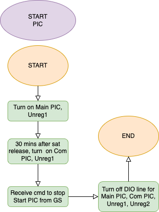
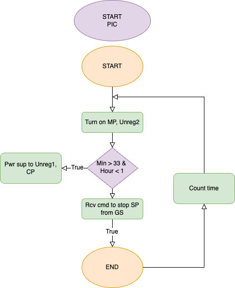
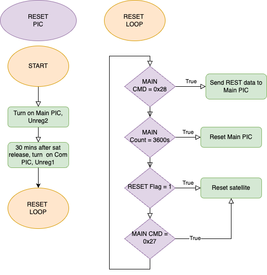

# BIRDSRP-OBC

 <h1>
  BIRDS-RP SATELLITE SOFTWARE DEVELOPER’S MANUAL 
 </h1>

## Introduction 
 
### Document Purpose 
This document is prepared to share a thorough explaination of the execution of the BIRDS-RP satellite bus software. 

 
The system block diagram of the BIRDS-RP satellite is detailed in figure 1 below. 
 
BUS SYSTEM BLOCK DIAGRAM
  
OBC BLOCK DIAGRAM
 
DETAILED OBC BLOCK DIAGRAM
 
The organisational file stucture of the microcontrollers in the BIRDS-RP OBC board is detailed in  figure 2 below. 
 

## START PIC

|  After RBF removed |  After ISS release  | 
|----------------------|--------|
|  |    | 
| <a href="https://app.diagrams.net/#HBIRDSOpenSource%2FBIRDSRP-OBC%2Fmain%2FDiagrams%2Fpic_operations_ISS-START_PIC.png" target="_blank">Edit with draw.io</a> | <a href="https://app.diagrams.net/#HBIRDSOpenSource%2FBIRDSRP-OBC%2Fmain%2FDiagrams%2Fpic_operations-START-PIC.png" target="_blank">Edit with draw.io</a>  | 

The files found in the START PIC folder are detailed in Table 1 below. 

|  File name pattern   | Scope  |  Content    |
|----------------------|--------|-------------|
| STRATPIC.c |    |    |
|  StartPIC_Functions.c  |    |    |

## RESET PIC 

<a href="http://jgraph.github.io/drawio-github/edit-diagram.html?repo=BIRDSRP-OBC&path=pic_operations_ISS-RESET_PIC.png" target="_blank">Edit</a> | <a href="https://app.diagrams.net/#Uhttps%3A%2F%2Fraw.githubusercontent.com%2FBIRDSOpenSource%2FBIRDSRP-OBC%2Fmain%2FDiagrams%2Fpic_operations_ISS-RESET_PIC.png" target="_blank">Edit As New</a> | <a href="https://app.diagrams.net/#HBIRDSOpenSource%2FBIRDSRP-OBC%2Fmain%2FDiagrams%2Fpic_operations_ISS-RESET_PIC.png" target="_blank">Edit with draw.io</a>

The files found in the RESET PIC folder are detailed in Table 1 below. 

|  File name pattern   | Scope  |  Content    |
|----|----|----|
|    |    |    |
|    |    |    |

## MAIN PIC 

|  File name pattern   | Scope  |  Content    |
|----|----|----|
|    |    |    |
|    |    |    |

### MAIN.C 

### DEFINITIONS.H 
 
### DEVICE.H
 
### LIBUART.H 

### RTCPERIPHERAL.H 
 
### MEMORY_SETUP.H 
 
### FLASH_MEMORY.H 
 
### INTERPRETER.H  

## FAB PIC 

