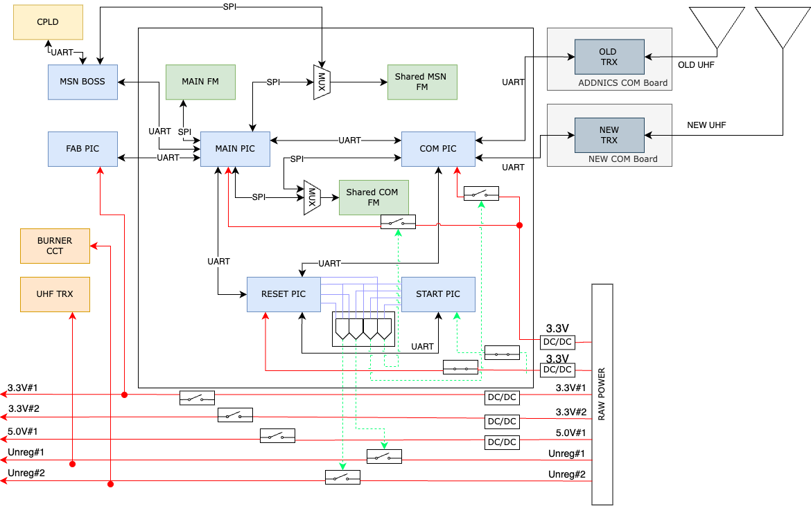

# BIRDSRP-OBC

<p align=center>

</p>
<div align="center">
  
</div>


# BIRDSRP-OBC
 Documentation for the ON BOARD COMPUTER AND GENERAL COMMAND AND DATA HANDLING files of the BIRDS-RP Satellite.


## About the BIRDS-RP Program:

The Mission Statement of the Project is:

> “The goal of our project is to bring diversity to the space sector and democratize the usage of space.”

The project is led by Kyushu Institute of Technology in Japan and involves students from XXX,XXX and Japan.

Satellite Name: Dragonfly (Japan), 

Stakeholders:  Our stakeholders are Kyushu Institute of Technology (Kyutech), Rwanda, Paraguay, Moldova, and the Association for Radio Digital Communications (ARDC).

Project duration: 2024-2026

CubeSat: 3U (30x10x10) cm3

Weight: N/Akg

Launch Date: 2026

BIRDS-X project is a 2U CubeSat dedicated to amateur radio communication.

## Organisation structure

```bash

├── 
├── 
├── 
├── 
└── README.md

```


### BUS SYSTEM BLOCK DIAGRAM
The system block diagram of the BIRDS-RP satellite is detailed in figure 1 below. 
 
### OBC BLOCK DIAGRAM

 
<a href="https://app.diagrams.net/#HBIRDSOpenSource%2FBIRDSRP-OBC%2Fmain%2FDiagrams%2Fobc-block-diagram.png" target="_blank">Edit with draw.io</a> 

### DETAILED OBC BLOCK DIAGRAM

 
<a href="https://app.diagrams.net/#HBIRDSOpenSource%2FBIRDSRP-OBC%2Fmain%2FDiagrams%2Fobc-detailed-block-diagram.png" target="_blank">Edit with draw.io</a> 
The organisational file stucture of the microcontrollers in the BIRDS-RP OBC board is detailed in  figure 2 below. 
 

<div align="center">
  <a href="https://lean-sat.org/opensource/">
  
  </a>
</div> 


## I like this project, can I help you?
You are welcome 🙂

* Give us a star ⭐
* Watch repository to be notified about updates 👀
* If you will find some errors, report them in Issues 🐞
* Try Birds designs on some real computer and let us know how it worked in Discussions. 💬
* We would greatly appreciate if you would also tell others about this ecosystem, it helps us to improve BIRDS Open Source. Thank you!
