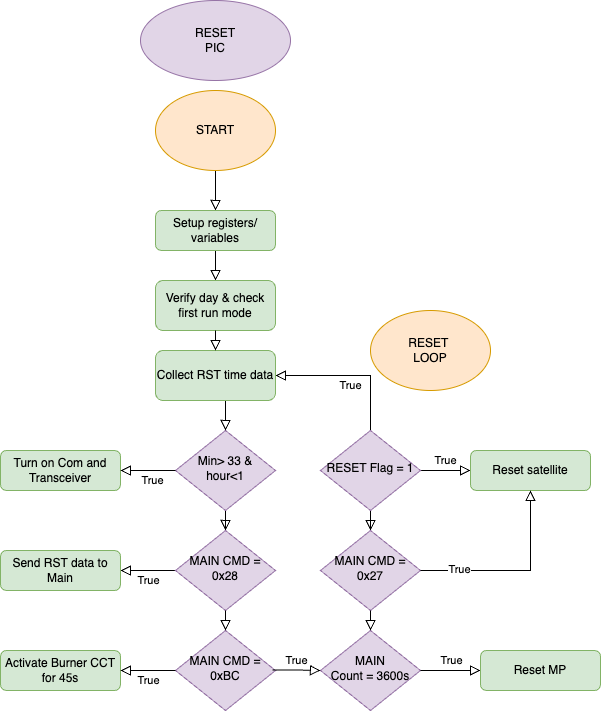

# BIRDSRP-OBC

 <h1>
  BIRDS-RP SATELLITE SOFTWARE DEVELOPER’S MANUAL 
 </h1>

## Introduction 
 
### Document Purpose 
This document is prepared to share a thorough explaination of the execution of the BIRDS-RP satellite bus software. 

 
The system block diagram of the BIRDS-RP satellite is detailed in figure 1 below. 
 
BUS SYSTEM BLOCK DIAGRAM
  
OBC BLOCK DIAGRAM
 
DETAILED OBC BLOCK DIAGRAM
 
The organisational file stucture of the microcontrollers in the BIRDS-RP OBC board is detailed in  figure 2 below. 
 

## START PIC

|  After RBF removed |  After ISS release  | 
|----------------------|--------|
|  |    | 
| <a href="https://app.diagrams.net/#HBIRDSOpenSource%2FBIRDSRP-OBC%2Fmain%2FDiagrams%2Fpic_operations_ISS-START_PIC.png" target="_blank">Edit with draw.io</a> | <a href="https://app.diagrams.net/#HBIRDSOpenSource%2FBIRDSRP-OBC%2Fmain%2FDiagrams%2Fpic_operations-START-PIC.png" target="_blank">Edit with draw.io</a>  | 

The files found in the START PIC folder are detailed in Table 1 below. 

|  File name pattern   | Scope  |  Content    |
|----------------------|--------|-------------|
|  STARTPIC.c |    |    |
|  StartPIC_Functions.c  |    |    |

## RESET PIC 
The following table shows the flow chart of operation for the RESET PIC after RBF pin is removed and 30 minute after the satellite is launched for the ISS.

|  After RBF removed   |  After ISS release  | 
|----------------------|---------------------|
|  |    | 
| <a href="https://app.diagrams.net/#HBIRDSOpenSource%2FBIRDSRP-OBC%2Fmain%2FDiagrams%2Fpic_operations_ISS-RESET_PIC.png" target="_blank">Edit with draw.io</a> | <a href="https://app.diagrams.net/#HBIRDSOpenSource%2FBIRDSRP-OBC%2Fmain%2FDiagrams%2Fpic_operations-RESET-PIC.png" target="_blank">Edit with draw.io</a>  | 

The files found in the RESET PIC folder are detailed in Table 1 below. 

|  File name pattern   | Scope  |  Content    |
|----|----|----|
|    |    |    |
|    |    |    |

## MAIN PIC 

After the satellite is released to its orbit, the startpic turn on the power line to the Main PIC

|  File name pattern   | Scope  |  Content    |
|----|----|----|
|    |    |    |
|    |    |    |

### MAIN.C 

### DEFINITIONS.H 
 
### DEVICE.H
 
### LIBUART.H 

### RTCPERIPHERAL.H 
 
### MEMORY_SETUP.H 
 
### FLASH_MEMORY.H 
 
### INTERPRETER.H  

## FAB PIC 

